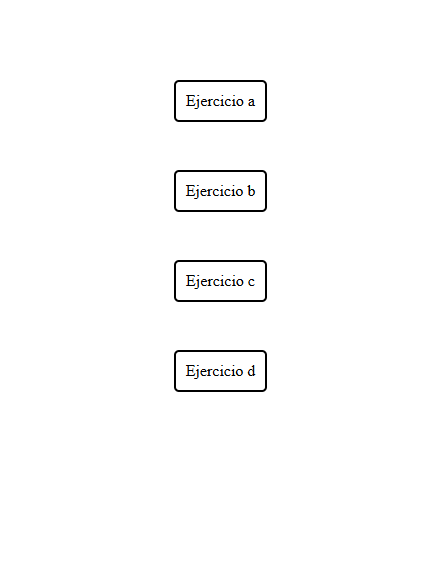
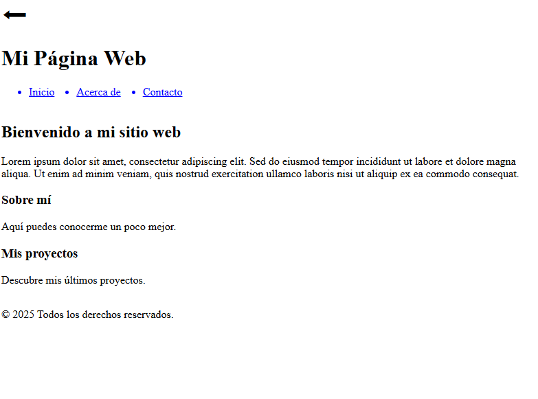
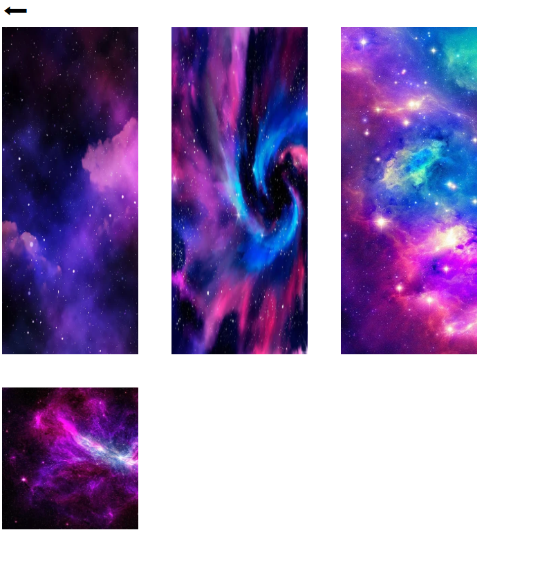
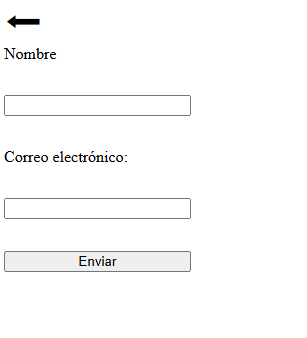
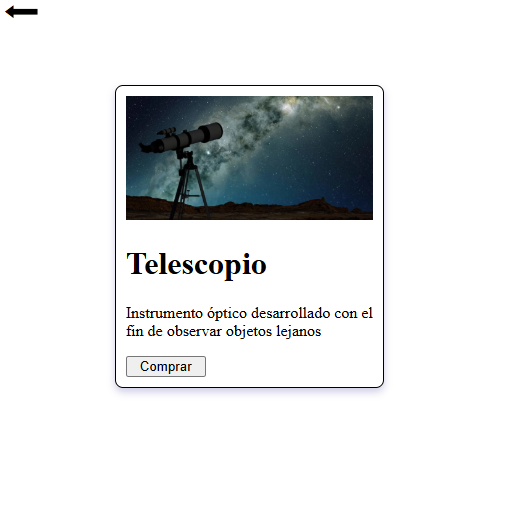

## Nombre: Sofía De Alessandre
## Link GitHub repositorio: https://github.com/SofiaDeAlessandre/responsive-desafio-12.git
## Link Netlify: 

### Descripción: el desafío 12 se trata de 4 archivos de diferentes temáticas pero responsives, utilizando media queries: Extra small: <576px; Small:	≥576px; Medium: ≥768px; Large: ≥992px; Extra large: ≥1200px y Extra extra large: ≥1400px

